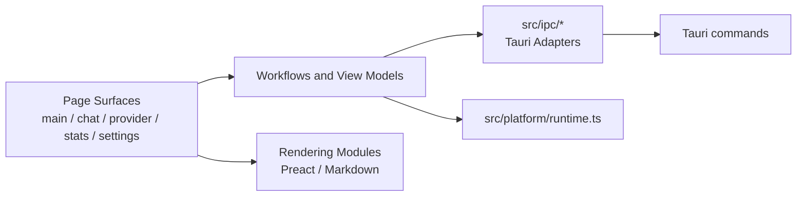

# Token Chat frontend architecture

This document is the entry point for the `token-chat` TypeScript/Tauri frontend. A **Module** owns an Interface and its Implementation; a **Surface** renders UI and connects events; an **Adapter** translates across a platform Seam.

## Dependency direction



Dependencies point inward from a Surface to domain-oriented Modules, then outward through explicit platform Adapters. A page Surface may read controls and connect events, but payload conversion, persistence workflows, sorting, filtering, and platform command shapes belong behind a Module Interface.

## Platform seams

### `src/ipc/`

This directory is the only frontend Adapter for Tauri `invoke`. Each file owns command names and translates frontend camelCase inputs to the Rust command shape:

- `chat-ipc.ts`: conversations, messages, generation, token usage, and file reads.
- `provider-catalog.ts`: Provider and Model catalog commands.
- `search-ipc.ts`: Web Search configuration and execution.
- `stats-snapshot.ts`: statistics query snapshots.
- `prompt-ipc.ts`: the built-in system prompt.

Callers should depend on these typed Interfaces and must not assemble Tauri command payloads in a Surface.

### `src/platform/runtime.ts`

This Module is the only place that detects `window.__TAURI_INTERNALS__`. Browser development adapters use `isWebRuntime()`; desktop paths use `isTauriRuntime()`. Keeping detection here prevents platform checks from spreading through rendering and data conversion code.

## Chat

`chat.ts` is the Chat Surface entry. It mounts `ConversationList`, `MessageList`, `ChatInput`, and `RightPanel`, connects their callbacks, and does not own the send sequence.

`ChatRunWorkflow` in `chat-run-workflow.ts` owns the ordered send/cancel workflow: prepare the draft, optionally search, persist the user message, create the streaming assistant message, call the model, persist the result, record usage, and refresh projections. `chat-run-model.ts` contains the pure message and status transformations used by that workflow.

`chat-conversation.ts` owns conversation lifecycle operations. `chat-view-model.ts` projects conversations and safe Web Search sources for the Preact rendering Modules. `chat-stream.ts` is the Tauri event Adapter for streaming chunks and metrics.

`chat-render.ts` now contains only small DOM utilities needed during the gradual Preact migration; it is not a second message renderer.

## Markdown rendering

`src/rendering/markdown-renderer.ts` exposes one primary Interface:

```ts
renderMarkdown(content: string): string
```

Its Implementation combines `markdown-it` parsing, MathJax SVG rendering, URL validation, escaping, and browser-only code-copy handling. Callers do not depend on either library directly. Raw model HTML is disabled; see ADR-0001 and ADR-0002.

## Provider management

`provider.ts` is the Provider page Surface. `provider-form-model.ts` owns form normalization and Provider/Model payload construction. `provider-catalog-view-model.ts` owns selection and list/detail projections. Platform commands remain in `ipc/provider-catalog.ts`.

To add a field, update the form model first, then its tests, then connect the Surface control. Do not construct Rust payloads in DOM handlers.

## Statistics

`stats.ts` is the statistics page Surface and owns SVG/DOM rendering. The calculation Interfaces are split by concern:

- `stats-view-model.ts`: ranges, currency normalization, totals, and table sorting.
- `token-trend-model.ts`: trend scope, model selection, date windows, and series visibility.
- `stats-export-model.ts`: JSON and CSV serialization.
- `ipc/stats-snapshot.ts`: Tauri query Adapter.

New calculations belong in a model Module with browser-free tests. The Surface should receive display-ready values.

## Settings

`settings.ts` is the Settings Surface. `settings-state.ts` owns stable local preference keys and normalization. `appearance-settings-model.ts`, `prompt-library-model.ts`, and `search-settings-model.ts` own their respective state and workflows. Existing `font-size.ts` and `currency.ts` own font and currency persistence.

## Architecture constraints

- `invoke(...)` appears only in `src/ipc/*`.
- Tauri runtime detection appears only in `src/platform/runtime.ts`.
- Model output is untrusted and reaches `innerHTML` only after the Markdown rendering Module processes it.
- A page Surface does not own platform payload conversion or reusable data transformations.
- Pure Module Interfaces are covered by Vitest; browser smoke tests verify rendering and event wiring only.

## Verification

From `token-chat/` run:

```sh
npm test
npm run build
npx tsc --noEmit --noUnusedLocals --noUnusedParameters
```

From `token-chat/src-tauri/` run `cargo test`. Also run `git diff --check` and scan the two architecture constraints above before merging.
